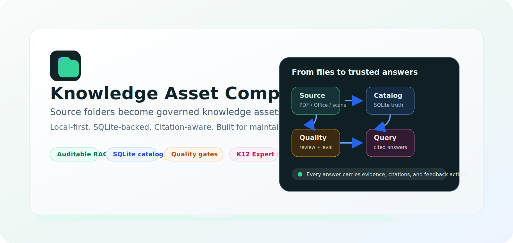
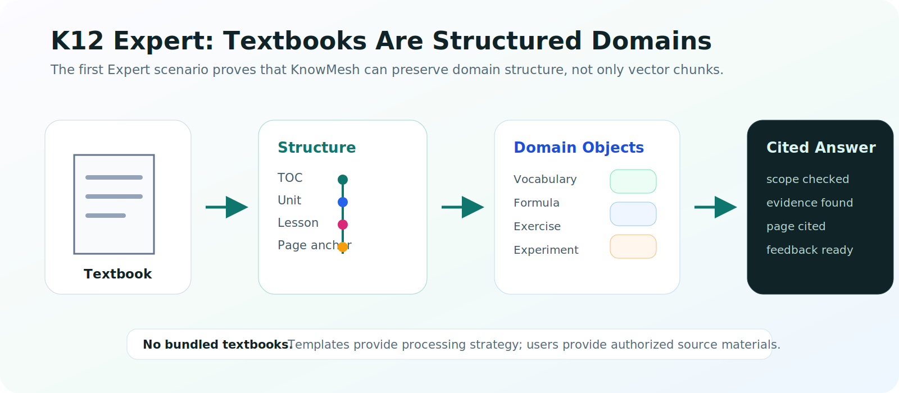

<div align="center">

# KnowMesh

**Compile real document folders into auditable, traceable, maintainable knowledge assets.**

Local-first knowledge asset compiler for auditable RAG, traceable citations, and maintainable document intelligence.

[中文](README.md) · [Documentation](docs/README.en.md) · [Current Design](docs/current-design.md) · [Getting Started](docs/getting-started.en.md) · [Architecture](docs/architecture.en.md)

[](https://github.com/shineway-tech/KnowMesh/actions/workflows/ci.yml)
[](https://github.com/shineway-tech/KnowMesh/actions/workflows/codeql.yml)
[](https://github.com/shineway-tech/KnowMesh/actions/workflows/scorecard.yml)
[](LICENSE)
[](package.json)
[](docs/current-design.md)
[](docs/current-design.md)
[](CHANGELOG.md)



</div>

KnowMesh is not a "upload files and ask a model" RAG demo, and it is not another vector database UI. It treats source folders as long-lived knowledge assets: pages, blocks, structures, chunks, citations, quality states, versions, and Query Runtime contracts that can be inspected, maintained, rolled back, and integrated.

Watch this project if you care about:

- RAG answers that cite source files, pages, sections, or structure anchors.
- Documents that change over time and need diffs, targeted reruns, versions, and rollback.
- Multiple knowledge bases with isolated setup, tasks, logs, feedback, releases, and generated assets.
- Durable local state that survives refreshes, port changes, and service restarts.
- Domain-aware knowledge bases. K12 textbooks are KnowMesh's first Expert scenario.

## Why KnowMesh Exists

RAG prototypes can answer questions that look plausible. Real systems need harder guarantees: where the evidence came from, which content needs review, what changed after a source update, whether a version can roll back, and whether external applications use the same query contract as the console.

| Ordinary RAG demo | KnowMesh |
| --- | --- |
| Upload files | Compile source folders |
| Chunk and embed | Extract pages, blocks, structures, chunks, and citations |
| Vector store as truth | SQLite catalog as truth; vectors accelerate retrieval |
| Weak answers can look successful | Query gates require evidence, citations, and refusal states |
| Rebuild from scratch | Checkpoint, retry, targeted rerun, version, rollback |
| UI answer path is enough | Console and integration APIs use the same Query Runtime |

## How It Works


1. Create or select a knowledge base.
2. Scan a source folder and classify PDFs, Office files, WPS files, images, scans, and risky inputs.
3. Write queryable state into `workspace.sqlite` and each knowledge base's `catalog.sqlite`; large files stay in artifacts.
4. Run quality gates: review queues, evaluations, citation checks, and low-confidence handling.
5. Publish rollback-ready knowledge versions and sidecars / indexes for retrieval and integration.
6. Query Runtime answers with evidence, citations, checks, and feedback actions.

## Core Capabilities

| Capability | What You Get |
| --- | --- |
| Local-first Web Console | Ordinary users start from a local Web Console, usually on `127.0.0.1:7457`. |
| SQLite-first state | `workspace.sqlite` stores global workspace state; each knowledge base owns one `catalog.sqlite`. |
| Multi-KB isolation | Each knowledge base isolates setup, tasks, assets, logs, feedback, versions, and maintenance state. |
| Recoverable long tasks | Scan, OCR, embedding, and write steps checkpoint, log, pause, retry, and recover. |
| Traceable citations | Query Runtime requires sources, pages, or structure anchors instead of counting weak answers as success. |
| Quality maintenance loop | Low-confidence content enters review; user feedback can become maintenance work; versions can diff and roll back. |
| Expert scenarios | Core stays domain-neutral; K12 is the first strengthened Expert, with room for more domains. |
| Provider boundaries | OCR, parsers, embeddings, rerank, vector stores, object stores, and exports stay replaceable. |

## 30-Second Start

KnowMesh is currently alpha. Ordinary users start from the local Web Console; maintainers can first use credential-free checks.

### User Launchers

```bash
# Windows
.\knowmesh.cmd start
launcher\knowmesh.cmd start

# macOS / Linux
./knowmesh start
launcher/knowmesh start
```

The launcher first looks for Node.js 24+. If it is missing, it prepares a private Node runtime and does not modify the system PATH.

### Maintainer Entry

```bash
npm install
node ./src/cli/knowmesh.mjs start
npm run doctor
npm run demo:plan
```

KnowMesh starts a local service at `http://127.0.0.1:7457` by default. Local smoke and demo checks do not upload files, call OCR, call embedding, or write vector indexes.

## First Expert Scenario: K12 Textbook Knowledge Bases

K12 is not the whole product identity. It is the first scenario that proves the Expert model. Textbooks are not generic PDFs: they have table-of-contents structure, units, lessons, vocabulary, formulas, exercises, page anchors, and strict scope boundaries.



KnowMesh Expert - K12 aims to compile textbook materials into structured knowledge assets:

- Chinese: texts, authors, annotations, vocabulary, after-class questions, oral communication, and writing tasks.
- Math: concepts, examples, formulas, diagrams, conditions, solution steps, exercises, and explanations.
- English: Unit, Lesson, Words, Sentences, Dialogue, and Phonics.
- Science: experiment purpose, materials, steps, observations, and conclusions.
- Citations: source book, page, section, or structure anchor.

KnowMesh does not bundle textbook content. Templates provide processing strategy; users must provide their own or authorized materials.

## Current Status

KnowMesh is in `0.1.0-alpha`. The direction and foundation are real, but this is not a stable commercial release yet.

Implemented foundation:

- SQLite-first workspace and per-KB catalog.
- One-time K12 migration preservation.
- Multi-knowledge-base isolation and scoped routes.
- Task checkpoints, logs, pause, retry, and recovery.
- Query Runtime shared by console testing and integration APIs.
- Document maintenance, feedback review, version records, and diagnostics export.
- Release smoke, artifact install smoke, and package boundary gates.
- Windows / Ubuntu CI on Node.js 24.
- CodeQL, OpenSSF Scorecard, secret scanning, push protection, and private vulnerability reporting.
- `main` branch protection requires Ubuntu / Windows CI, PR review, and resolved conversations.

Near-term priorities:

- Stronger Query Runtime usability.
- Expert plugin boundaries and authoring documentation.
- Better local parser / OCR provider adapters.
- OpenAPI-ready integration contract.

See [ROADMAP.en.md](ROADMAP.en.md) for the fuller roadmap.

## Who It Is For

| Audience | Why They May Care |
| --- | --- |
| RAG / AI app builders | They want citations, quality gates, feedback loops, and integration-ready knowledge assets. |
| Knowledge engineering teams | They need changing documents to become maintainable, evaluable, rollback-ready assets. |
| Education and K12 teams | Textbooks need TOC, unit, lesson, vocabulary, formula, exercise, and page structure, not generic PDF QA. |
| Open-source infrastructure contributors | They care about local-first, SQLite, document AI, provider adapters, and Expert plugin ecosystems. |

## Development and Verification

```bash
npm test
npm run smoke:release
npm run smoke:artifact
npm run verify:package-boundary
npm run doctor
npm run demo:plan
```

## Repository Layout

```text
assets/brand/             Logo and brand assets
assets/readme/            README visual assets
assets/social/            Repository social preview assets
configs/                  Reusable configuration templates
docs/                     Documentation and current design authority
examples/local-demo/      Credential-free local example
examples/textbook-cn-k12/ K12 Aliyun example config
launcher/                 Node-independent user launchers
schemas/                  JSON schemas
scripts/                  Release and package verification scripts
src/cli/                  Local command entry
src/core/                 Core planning and template logic
src/local-service/        Local HTTP service and APIs
src/web-console/          Local Web Console
```

## Documentation

- [Documentation Center](docs/README.en.md)
- [Getting Started](docs/getting-started.en.md)
- [Architecture Overview](docs/architecture.en.md)
- [Roadmap](ROADMAP.en.md)
- [Project Map](docs/project-map.en.md)
- [Good First Issues](docs/good-first-issues.en.md)
- [Current Design](docs/current-design.md)
- [Operations Runbook](docs/phase1-6-operations-runbook.md)
- [Changelog](CHANGELOG.md)
- [Contributing](CONTRIBUTING.md)
- [Security Policy](SECURITY.md)

`docs/current-design.md` is the only current design authority. The README and other docs are entry points, explanations, and operating guides.

## Contributing

You are welcome to follow the project, try it locally, open issues, improve docs, discuss Expert scenarios, or work on provider adapters. Please read [CONTRIBUTING.md](CONTRIBUTING.md) first.

Report security issues privately through [SECURITY.md](SECURITY.md). Do not put vulnerability details, secrets, document text, logs, or local paths in public issues.

## License

MIT. See [LICENSE](LICENSE).
