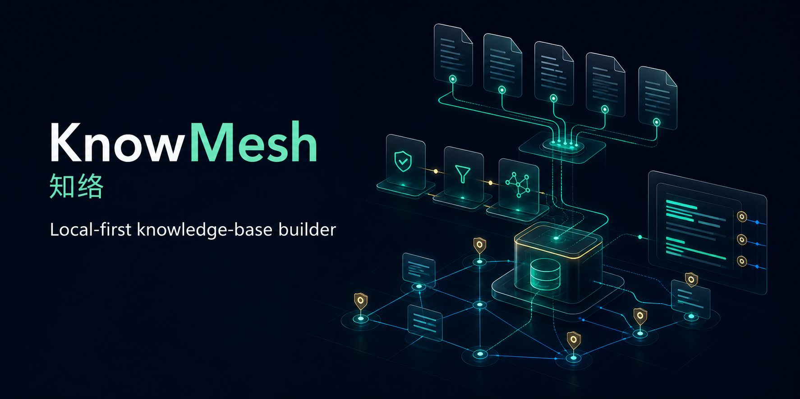
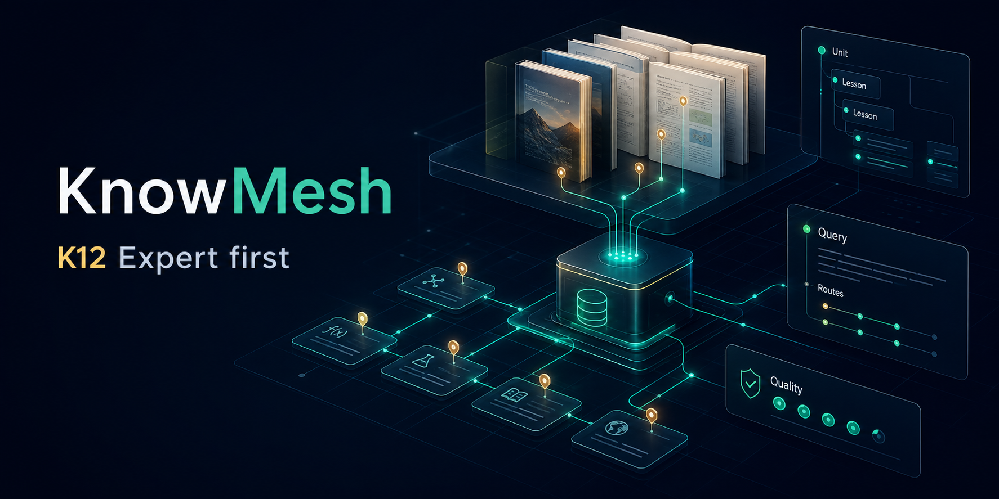

# KnowMesh

> Turn real document folders into auditable, traceable, and maintainable knowledge bases.

[中文](README.md) | [Documentation](docs/README.en.md) | [Current Design](docs/current-design.md) | [Getting Started](docs/getting-started.en.md) | [Architecture](docs/architecture.en.md)



[](https://github.com/shineway-tech/KnowMesh/actions/workflows/ci.yml)
[](https://github.com/shineway-tech/KnowMesh/actions/workflows/codeql.yml)
[](https://github.com/shineway-tech/KnowMesh/actions/workflows/scorecard.yml)
[](LICENSE)
[](package.json)
[](docs/current-design.md)
[](docs/current-design.md)
[](CHANGELOG.md)

KnowMesh is a local-first, open-source knowledge-base builder. It is not a demo that uploads files into a vector database and calls it done. KnowMesh treats source folders as long-lived knowledge assets that need provenance, quality gates, versioning, rollback, evaluation, and integration contracts.

Watch this project if you care about:

- RAG answers that cite source files, pages, sections, or original snippets.
- Document updates that create versions instead of silently overwriting prior results.
- Isolated setup, tasks, logs, feedback, versions, and generated assets per knowledge base.
- Local state that survives refreshes, port changes, and service restarts.
- Domain-aware knowledge bases. K12 textbooks are the first major enhanced scenario.

## Why Not Another RAG Demo

Many knowledge-base tools begin with "upload files" and end with "ask a model." KnowMesh takes a different route: compile source materials into governed knowledge assets, then let Query Runtime answer only when there is enough evidence.

```text
Source Folder
  -> Scan and classify files
  -> Extract pages, blocks, tables, figures, formulas
  -> Build domain structures and chunks
  -> Write indexes and sidecars
  -> Run quality gates and evaluations
  -> Publish versioned, cited, maintainable knowledge assets
```

KnowMesh is designed to answer operational questions that matter after the first demo:

- Where did this answer come from?
- Which content is low-confidence and needs review?
- Which files changed, and can we rerun only the affected material?
- Can this knowledge base roll back to a previous version?
- Can external applications use the same Query Runtime contract as the console?

## Core Capabilities

| Capability | What it means |
| --- | --- |
| Local-first Web Console | The primary user entry is a local Web Console on `127.0.0.1:7457`. |
| SQLite-first state | `workspace.sqlite` stores global workspace state; each knowledge base owns a `catalog.sqlite`. |
| Multi-KB isolation | Setup, tasks, assets, logs, feedback, versions, and maintenance state are isolated per knowledge base. |
| Recoverable long tasks | Scan, OCR, embedding, and write steps use checkpoints, logs, pause, retry, and recovery. |
| Traceable citations | Query Runtime requires source, page, or structure anchors and does not count weak answers as success. |
| Quality gates | Low-confidence content enters review instead of disappearing silently. |
| K12 enhanced scenario | The first major domain is China K12 textbooks: TOC, units, lessons, vocabulary, formulas, exercises, and page citations. |
| Aliyun mode | The current production-shaped path targets Aliyun OSS, OSS Vector, and Model Studio / DashScope. |

## Quick Start

KnowMesh is currently alpha. Ordinary users start from the local Web Console; maintainers can use the credential-free demo to check the local environment.

### User Startup

```bash
# Windows
.\knowmesh.cmd start
launcher\knowmesh.cmd start

# macOS / Linux
./knowmesh start
launcher/knowmesh start
```

Launchers look for Node.js 24+. If Node is missing, they prepare a private runtime without modifying the system PATH.

### Maintainer Entry

```bash
npm install
node ./src/cli/knowmesh.mjs start
npm run doctor
npm run demo:plan
```

KnowMesh starts a local service by default: `http://127.0.0.1:7457`.

## How It Works


1. Create or select a knowledge base.
2. Configure mode, providers, template, source scope, and retrieval policy.
3. Scan the source folder for formats, split files, missing items, and risks.
4. Extract pages, paragraphs, tables, figures, formulas, and layout signals.
5. Use Experts to build domain structures, such as K12 units, lessons, vocabulary, formulas, and exercises.
6. Clean, chunk, score, index, and publish sidecars.
7. Run quality gates and evaluations before publishing a rollback-ready version.
8. Serve console testing and external integrations through the same Query Runtime.

## First Major Scenario: K12 Textbook Knowledge Bases

K12 is not just a tag. It is a structured knowledge domain. KnowMesh Expert - K12 is designed to understand:



- stage, grade, subject, volume, edition, unit, lesson, and page;
- Chinese textbook lessons, authors, annotations, vocabulary tables, exercises, oral communication, and writing tasks;
- math concepts, examples, formulas, diagrams, conditions, solution steps, exercises, and answer explanations;
- English units, lessons, words, sentences, dialogues, phonics, and culture sections;
- science experiment purpose, materials, steps, observations, and conclusions;
- strict refusal for out-of-scope subjects, books, and unsupported questions.

KnowMesh does not bundle textbook content. Templates provide processing strategy only. Users are responsible for using owned or authorized source materials.

## Current Status

KnowMesh is in `0.1.0-alpha`. The direction and foundation are real, but this is not a stable commercial release yet.

Implemented foundation:

- SQLite-first workspace and per-KB catalog.
- One-time K12 migration preservation.
- Multi-knowledge-base isolation and scoped routes.
- Release smoke, artifact install smoke, and package boundary gates.
- Windows / Ubuntu CI on Node.js 24.
- CodeQL, OpenSSF Scorecard, secret scanning, push protection, and private vulnerability reporting.
- `main` branch protection requires Ubuntu / Windows CI, PR review, and resolved conversations.

Near-term priorities:

- Stronger Query Runtime usability.
- Expert plugin boundaries and authoring documentation.
- Better parser / OCR provider adapters.
- OpenAPI-ready integration contract.

## Who It Is For

- Teams that want document knowledge bases to become long-lived assets.
- RAG application builders who need citations, versions, evaluations, and maintenance workflows.
- Education and knowledge-engineering scenarios, especially textbooks, course materials, training content, policies, and product documentation.
- Open-source contributors interested in local-first systems, SQLite, document intelligence, and auditable AI infrastructure.

## Development Checks

```bash
npm test
npm run smoke:release
npm run smoke:artifact
npm run verify:package-boundary
npm run doctor
npm run demo:plan
```

These checks are local. They do not upload files, call OCR, call embedding, or write vector indexes.

## Repository Layout

```text
assets/brand/             Logo and brand assets
assets/readme/            README visual assets
assets/social/            Repository social preview PNG
configs/                  Reusable configuration templates
docs/                     Documentation and current design authority
examples/local-demo/      Credential-free local example
examples/textbook-cn-k12/ K12 Aliyun example config
launcher/                 Node-independent user launchers
schemas/                  JSON schemas
scripts/                  Release and package verification scripts
src/cli/                  Local command entry
src/core/                 Core planning and template logic
src/local-service/        Local HTTP service and APIs
src/web-console/          Local Web Console
```

## Documentation

- [Documentation Home](docs/README.en.md)
- [Getting Started](docs/getting-started.en.md)
- [中文快速入门](docs/getting-started.zh-CN.md)
- [Architecture Overview](docs/architecture.en.md)
- [架构概览](docs/architecture.zh-CN.md)
- [Current Design](docs/current-design.md)
- [Operations Runbook](docs/phase1-6-operations-runbook.md)
- [Changelog](CHANGELOG.md)
- [Contributing](CONTRIBUTING.md)
- [Security Policy](SECURITY.md)

`docs/current-design.md` is the single current design authority. README and other docs are entry points, explanations, and operational guides.

## Contributing

Stars, issues, docs improvements, domain Expert discussions, and provider adapter contributions are welcome. Please read [CONTRIBUTING.md](CONTRIBUTING.md) first.

Security issues should be reported privately as described in [SECURITY.md](SECURITY.md). Do not include exploit details, secrets, document text, logs, or local paths in public issues.

## License

MIT. See [LICENSE](LICENSE).
