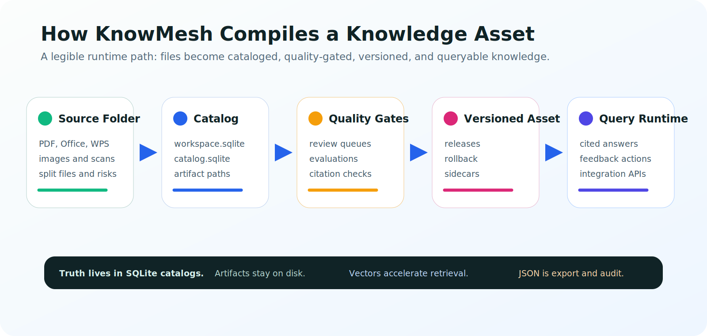

# KnowMesh 架构概览

[English](architecture.en.md) | [文档中心](README.md) | [项目首页](../README.md)

> 本文是架构入口，不是新的设计权威。完整产品、数据和开发纪律以 `docs/current-design.md` 为准。

KnowMesh 的核心目标是做本地优先的 Knowledge Asset Compiler：把源资料编译成可信、可检查、可维护、可集成的知识资产。它不是 OCR 工具、向量库 UI 或本地聊天 demo。



## 五层架构

| 层 | 职责 |
| --- | --- |
| KnowMesh Core | 通用生命周期：scan、extract、OCR orchestration、clean、structure、chunk、embed、write、version、evaluate、recover。 |
| KnowMesh Expert | 行业插件：定义领域语义、处理器、质量门禁、评测集和 query-router 规则。K12 是第一个主要 Expert 场景。 |
| Knowledge Asset Layer | 文档、页面、块、结构、chunk、引用、评测、反馈、版本和 release manifest 的事实层。 |
| Provider Layer | 可替换 OCR、parser、model、embedding、rerank、vector store、object store 和 export provider。 |
| Platform Layer | Windows、macOS、Linux 的路径、启动器、文件选择、打开文件夹、进程管理和私有运行时。 |

## SQLite-first 状态

KnowMesh 不把零散 JSON 当运行时事实源。

- `workspace.sqlite`：知识库注册表、当前选择、展示元数据、setup/task 摘要、路径、偏好和迁移历史。
- `catalog.sqlite`：每个知识库独立，保存 setup、任务、文档、页面、结构、chunk、索引、版本、反馈、评测和质量队列。
- 文件系统：保存原始文件、页面图像、OCR 响应、normalized 输出、报告和其他大文件。
- JSON / JSONL：用于导出、审计、云 sidecar 和人工可读报告，不作为主要运行时状态。

## 知识编译流水线

```text
1. Create or select knowledge base
2. Configure mode, providers, template, source scope, retrieval policy
3. Scan source folder and classify files
4. Resolve logical documents and split-file groups
5. Extract text, pages, tables, figures, formulas, layout
6. Classify pages and blocks
7. Generate domain structures through Expert plugins
8. Clean, normalize, and quality-score content
9. Create chunks by knowledge object
10. Build structure, keyword, vector indexes and sidecars
11. Run evaluations and quality gates
12. Publish a version only when gates pass
13. Serve query, citations, feedback, maintenance, and integration APIs
```

## Query Runtime

控制台问答和外部集成必须使用同一个 Query Runtime。一个可用答案至少需要：

- 匹配知识库范围；
- 找到足够证据；
- 引用源文档、页码或结构锚点；
- 证据支持答案；
- 不把越界拒答和弱答案算作成功；
- 不暴露异常、provider 内部信息或 `[object Object]`。

## K12 Expert

K12 是第一个主要强化场景。它要求结构化理解：

- 学段、年级、学科、册次、版本、单元、课文和页码；
- 语文词表、课文、注释、课后题、口语交际和习作；
- 数学概念、公式、例题、练习和答案解析；
- 英语 Unit、Lesson、Words、Sentences 和 Dialogue；
- 科学实验目的、材料、步骤、观察和结论；
- 越界问题在 retrieval 前拒绝。

## 质量门禁

KnowMesh 不把“有向量记录”当作知识库完成。质量门禁覆盖：

- source scope；
- extraction / OCR 状态；
- chunk 来源、页码、结构路径和质量状态；
- sidecar 和 vector record 一致性；
- evaluation set；
- query evidence 和 citation support。

## 延伸阅读

- [Current Design](current-design.md)
- [Operations Runbook](phase1-6-operations-runbook.md)
- [Getting Started](getting-started.zh-CN.md)
